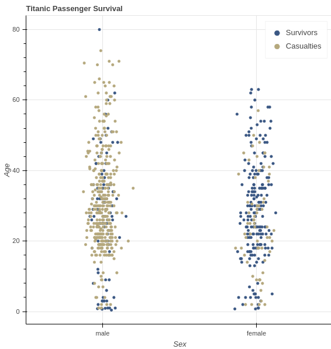
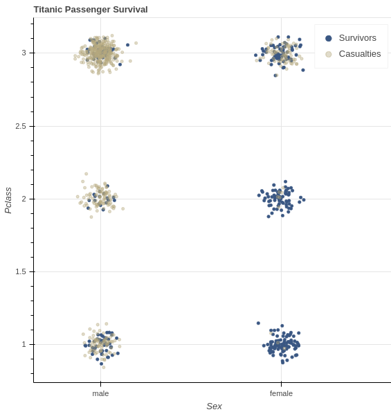

# Titanic: Machine Learning from Disaster
Below is an analysis of taking on Kaggle's [Titanic ML competition](https://www.kaggle.com/c/titanic/overview).
- [Getting to know the data](#getting-to-know-the-data)
- [Simple models](#simple-models)
- [Cross validation](#cross-validation)
- [Feature transformation](#feature-transformation)
- [Tuning our tree](#tuning-our-tree)
## Getting to know the data
The provided training data contains 892 samples and 9 features other than the target label. Thus, according to the [curse of dimensionality](https://en.wikipedia.org/wiki/Curse_of_dimensionality), we may need to perform some transformation of our feature space, but it’s not so large that I’ll commit any effort to that yet. Instead, I'll look for correlation between features and labels and just get a feel for the data in general. It's also important to note that of our 892 training samples, 342 are survivors and 549 are not, so there is some imbalance in the data but not so significant that I'm overly concerned at this point.

Below is a plot showing passengers' sex and age and whether or not they survived. I've added random noise to the x-axis purely for visualization so that fewer points overlap. Clearly a higher percentage of women onboard survived than men, but there doesn't seem to be a strong correlation between age and survival.



Next is a plot showing passengers' sex again but this time with the class of their ticket. This time I've added noise to both axes as well as some transparency to the casualties since they dominate the space. We already know there is a correlation between sex and survival, but this plot indicates there may also be some correlation between ticket class and survival (look how few casualties there are in the female 1<sup>st</sup> & 2<sup>nd</sup> class ticket clusters).



Since there's visual correlation between survival and at least 2 attributes, let's go ahead and train a simple model and see how it performs. Since some of our features aren't easily converted to numbers (e.g. how does cabin 'C85' relate to cabin 'C23 C25 C27'?), and I want to start with a simple model, I'll select a subset of features to use for training. I initially chose ticket class, sex, age, count of siblings/spouse on board, count of parents/children on board, and ticket fare. However, it turns out we don't know the age of 177 passengers. Since data is somewhat limited for this exercise *and* we already saw that age doesn't have strong correlation, I'll omit it for now.

## Simple models
For comparison, we'll train two models. For the 1<sup>st</sup>, we're using sklearn's implementation of a random forest classifier with mostly default parameters. For the 2<sup>nd</sup>, we'll build a simple neural network in PyTorch that takes the five features we're currently using, undergoes a linear transformation plus a non-linear activation (Sigmoid) to output five features to another layer that uses the same transformation & activation but outputs our prediction.
```python
import torch.nn as nn
class TitanicPredictor(nn.Module):
    def __init__(self, num_features, num_targets):
        super().__init__()
        self.fc1 = nn.Linear(in_features=num_features, out_features=num_features)
        self.out = nn.Linear(in_features=num_features, out_features=num_targets)

    def forward(self, x):
        sig = nn.Sigmoid()
        x = sig(self.fc1(x))
        x = sig(self.out(x))
        return x
```
Our neural network training loop will use mean squared error to measure loss and the Adam algorithm to update our weights. We'll start with a static learning rate.
```python
def train_model(features, labels):
    model = nn_model.TitanicPredictor(len(features[0]), 1)
    loss_fn = torch.nn.MSELoss()
    optimzer = torch.optim.Adam(model.parameters(), lr=0.001)

    EPOCHS = 1000
    loss_list = []

    for i in range(EPOCHS):
        predictions = model.forward(features)
        loss = loss_fn(predictions, labels)
        loss_list.append(loss)

        optimzer.zero_grad()
        loss.backward()
        optimzer.step()

    return model
```
To appropriately evaluate our model's performance we'll need to hold out a portion of our training data for cross-validation, but we'll get there when we're ready for hyperparameter tuning. For now, let's train these simple models and make a submission.

On the training data, our neural network achieved: 77.6% precision, 56.7% recall, and 77.1% accuracy. The random forest achieved 91.7% precision, 87.7% recall, and 92.3% accuracy. Our actual submissions using the testing dataset resulted in 70.8% accuracy (neural net) and 75.4% (forest). For comparison, I submitted the file provided by Kaggle which predicts that all women survive and all men do not. It achieved 76.6% accuracy which beat both of our models, so clearly we have work to do!

## Cross validation
Before we can tune our model's hyperparameters or architecture or perform any feature engineering, we need a way to reliably evaluate our model's performance. Sure, we could keep submitting to Kaggle and see how we do, but this is time-consuming, and more importantly we normally want to generalize. If we use our performance on the test set to inform decisions we make about our model's parameters, then we've effectively tuned our model to that data and can no longer make a claim about how it will perform on new, unseen data in the future. Since this is a learning exercise, we'll carry this philosophy forward and use a cross-validation set to inform our decisions and let the test set be a true evaluation of our model's ability to generalize.

I started by reserving 25% of the provided training data for cross-validation.
```python
from sklearn.model_selection import train_test_split
train_features, cv_features, train_labels, cv_labels = train_test_split(train_features_array, train_labels_array, train_size=.75, random_state=1)
```
I've also gone ahead and added a decay schedule to our learning rate, but this likely won't play much of a factor for now.
```python
optimzer = torch.optim.Adam(model.parameters(), lr=0.005)
scheduler = torch.optim.lr_scheduler.MultiplicativeLR(optimzer, lr_lambda=lambda epoch: .9)
# ... then in our training loop:
if epoch_num % 50 == 0:
    scheduler.step()
```
## Feature transformation
You will find some (commented out) code that runs [scikit-learn's implementations](https://scikit-learn.org/stable/modules/decomposition.html#pca) of principal components analysis and independent components analysis, but ultimately I wasn't getting any improvement from my neural network by reducing the feature dimensionality or by increasing for that matter (adding the projected features as new features or adding polynomial combinations). I may revisit this model to show some of the interesting code & math, but for now, let's see where we can get with our random forest and save a more complex network architecture for another problem.
## Tuning our tree
Recall that our forest achieved 92.3% on the training data but only 75.4% on the test data. This is an obvious sign that we're overfitting. One approach to addressing this is a hyperparameter search using cross-validation to inform parameter values. With this being a scikit-learn model, a lot of the code needed for this is built in.
```python
def search_forest_params(features, labels):
    forest_model = RandomForestClassifier(max_depth=None, random_state=1)

    param_grid = [{'max_depth': list(range(1, 10)),
                   'n_estimators': [2 ** i for i in range(4, 11)],
                   'criterion': ['gini', 'entropy']}]
    search = GridSearchCV(forest_model, param_grid=param_grid, cv=5, verbose=1, n_jobs=8)
    search.fit(features, labels)
    print(search.cv_results_)
    print(search.best_estimator_)
```
The "tuned" random forest achieved 78.708% accuracy on the Kaggle leaderboard which is in the top 13% (higher if you count the 100% accurate models that "cheat" by looking at actual data of known survivors/casualties).
[Back to the top](#titanic-machine-learning-from-disaster)
